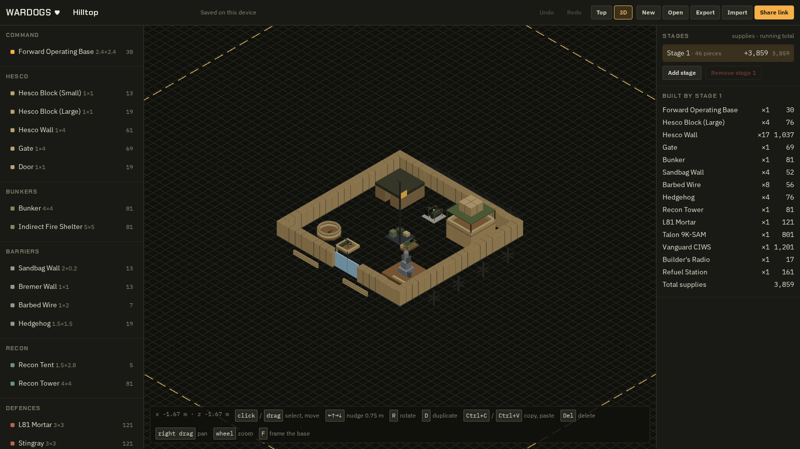

# wardogs ❤️

Tools for [Wardogs](https://www.wardogs.com). The first one is a **FOB planner**: lay out your base
in 3D before you spend a single supply on it.

**[Open the planner → wardogs.love/fob](https://wardogs.love/fob)**



## What it does

- Place every buildable piece on the game's grid, half-module offsets included.
- Stack pieces, turn them, and check that nothing overlaps.
- Split the build into stages and see what each one costs in supplies.
- See when a piece falls outside the FOB's build area.
- Keep as many plans as you like in your browser, with no account. Export a plan to a file, import
  one, or copy a share link for your squad.

## Controls

| To                     | Do                                                                  |
| ---------------------- | ------------------------------------------------------------------- |
| Place a piece          | Pick it in the palette, then click                                  |
| Place a row of copies  | Drag; hold `Shift` to keep the row straight                         |
| Turn it                | `R`                                                                 |
| Raise or lower it      | `PageUp` / `PageDown`, or `Ctrl` + wheel                            |
| Stop placing           | Right click or `Esc`                                                |
| Select                 | Click a piece, or drag a box; `Shift` toggles pieces in or out      |
| Move the selection     | Drag it, or nudge it with the arrow keys                            |
| Duplicate              | `D` puts the selection on your cursor                               |
| Copy and paste a group | `Ctrl+C`, then `Ctrl+V` and click to land each copy                 |
| Delete                 | `Delete` or `Backspace`                                             |
| Undo and redo          | `Ctrl+Z` and `Ctrl+Shift+Z` (or `Ctrl+Y`)                           |
| Switch views           | **Top** or **3D** in the top bar                                    |
| Move the camera        | Wheel zooms; right drag pans (Top) or orbits (3D); middle drag pans |
| Frame the base         | `F`                                                                 |

[`docs/fob-tool.md`](docs/fob-tool.md) has the details, including what the planner models on purpose
and what it leaves to you.

## The numbers

Piece sizes and costs come from community data and live in
[`libs/wardogs/game-data`](libs/wardogs/game-data/src/piece-catalog.ts). Each entry says whether it
has been checked in the game. Spot a wrong number? A pull request that fixes the catalog is very
welcome.

## Hacking on it

You need [Bun](https://bun.sh) at the version in `.bun-version`.

```sh
bun install
bun run dev   # http://localhost:3000
bun run e2e   # build the app and run the Playwright specs
```

[`AGENTS.md`](AGENTS.md) covers the repo layout, the checks CI runs, and the house rules for people
and agents alike. [`infra/README.md`](infra/README.md) covers the deploy.
